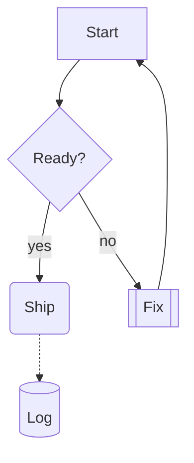
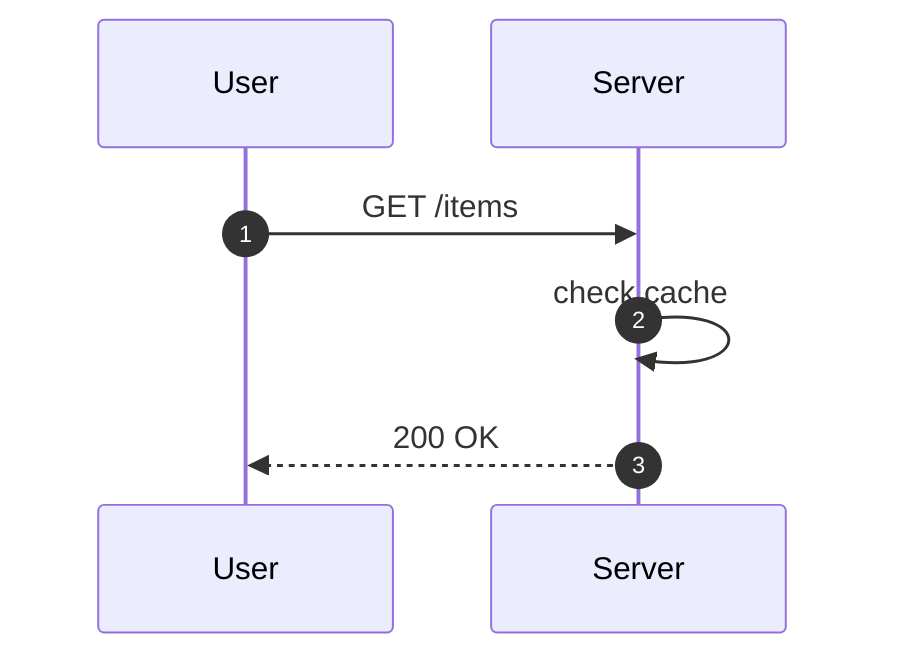
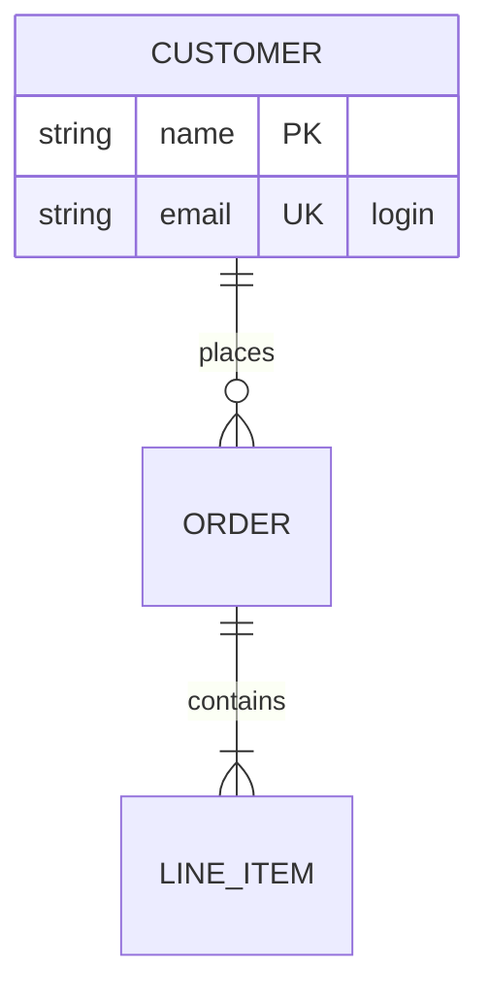
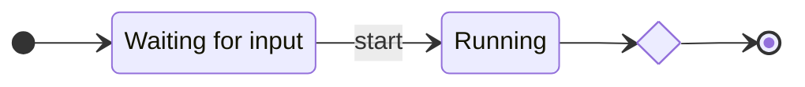

# FigJam boards and diagrams

The plugin runs in FigJam boards as well as design files and Slides decks. On a board the relay can
read everything — including how the shapes are connected — create the board's own building blocks,
and draw a Mermaid diagram as native, editable FigJam shapes and connectors.

## Which editor am I in?

`list_files` reports each connected file's `editorType`, and so does `get_metadata`: `"figma"` for a
design file, `"figjam"` for a board, `"slides"` for a deck. Which tools work depends on it:

| Tools                                                                             | Design file | FigJam | Slides |
| --------------------------------------------------------------------------------- | :---------: | :----: | :----: |
| Every read tool, `get_screenshot`, `run_script`                                   |     yes     |  yes   |  yes   |
| `set_text_content`, `set_node_properties`, `set_solid_fill`, `create_text`, …     |     yes     |  yes   |  yes   |
| `create_sticky`, `create_shape_with_text`, `create_connector`, `generate_diagram` |     no      |  yes   |   no   |
| `create_section`                                                                  |     yes     |  yes   |   no   |
| `create_page`, `create_frame`, `set_auto_layout` and the other design writes      |     yes     |   no   |   no   |

A tool used in the wrong editor is refused **before it touches the document**, with a message naming
the editor it needs — for example:

> create_sticky requires FigJam (sticky notes exist only in FigJam), but the plugin is currently in
> the design editor. Run the plugin in a FigJam board and retry, passing that file's fileKey.

The plugin does not run in Dev Mode. Figma does not let one plugin declare both Dev Mode and FigJam,
and FigJam is what this support needed.

## Reading a board

`get_document`, `get_node` and `get_selection` serialize FigJam nodes with the fields that carry their
meaning (full table in [serialized-nodes.md](../reference/serialized-nodes.md#figjam-fields)):

```json
{ "id": "4:1", "type": "STICKY", "text": "Ship it", "authorName": "Sam" }
{ "id": "4:2", "type": "SHAPE_WITH_TEXT", "text": "Ready?", "shapeType": "DIAMOND" }
{ "id": "4:3", "type": "CONNECTOR", "text": "yes",
  "connector": { "from": "4:2", "to": "4:1", "lineType": "ELBOWED" } }
```

**Connector endpoints are the point.** A diagram's meaning is its topology — what leads to what — and
without `connector.from` and `connector.to` a board reads as a pile of unrelated shapes. An end that
floats free on the canvas is `null`. Code blocks carry their `text` and `codeLanguage`, tables their
cell text as `table[row][column]`, and sections serialize as containers with their children.

## Writing to a board

Four tools, shaped like the design write tools: validated input, an optional `fileKey`, and the new
node's `nodeId` in the response.

- `create_sticky` — `{ text, x?, y? }`.
- `create_shape_with_text` — `{ text, shapeType?, x?, y?, width?, height? }`. `shapeType` is any
  FigJam shape: `SQUARE` (the default), `ELLIPSE`, `ROUNDED_RECTANGLE`, `DIAMOND`, `ENG_DATABASE`,
  `PREDEFINED_PROCESS`, `HEXAGON`, the triangles and parallelograms, and the rest of FigJam's list.
  `width` and `height` go together or not at all.
- `create_connector` — `{ startNodeId, endNodeId, text? }`. Both ends must already exist in the
  file; the connector attaches to them, so it follows when they move.
- `create_section` — `{ name?, x?, y?, width?, height? }`. Also works in design files.

## Drawing a diagram: `generate_diagram`

`generate_diagram` takes Mermaid source and draws it as FigJam shapes-with-text joined by connectors,
to the right of everything already on the page, then selects it and frames it in the viewport. The
server parses and lays it out; the plugin only creates what it is handed.

It is deliberately narrower than Mermaid. **Anything outside the subset below is refused with its
line number, and nothing is drawn.** There is no approximate rendering: a diagram that silently
dropped a subgraph or a note would look finished and be wrong, and nobody proof-reads a diagram they
asked a tool to draw.

Drawing is all-or-nothing too. If creating any shape or connector fails part-way, the tool removes
everything it had drawn before reporting the error.

Limits: 200 nodes and 400 edges per call. Split a larger diagram into several.

### Flowchart



- Header `flowchart` or `graph`, with an optional direction `TD`/`TB`, `BT`, `LR` or `RL`.
- Shapes: `A` and `A[rect]`, `A(round)`, `A([stadium])`, `A[[subroutine]]`, `A[(cylinder)]`,
  `A((circle))`, `A{diamond}`, `A{{hexagon}}`, `A[/parallelogram/]`, `A[\parallelogram\]`,
  `A[/trapezoid\]`. Quoted labels (`A["Say (hi)"]`) and `<br>` line breaks work. A stadium is drawn
  as FigJam's rounded rectangle, the closest shape it has.
- Links: `-->`, `---` (no arrowhead), `-.->` and `-.-` (dashed), `==>` and `===` (thick), `--o`
  (circle end), `<-->` (both ends), and their longer forms. Labels as `-->|text|` or `-- text -->`.
  Chains (`A --> B --> C`) and `;` between statements work.
- Refused: `subgraph`, `classDef`/`class`/`style`/`linkStyle`, `click`, `&`, `--x`, the `A>…]`,
  `A(((…)))` and `A[\…/]` shapes, and the `A@{ … }` syntax.

### Sequence diagram



Drawn as the participants in a row, a dashed lifeline under each, and one row per message in order —
the order is the meaning of a sequence diagram, so it is never collapsed. A message a participant
sends itself is drawn as a loop back to its own lifeline.

- `participant X [as Label]`, `actor X [as Label]` (both drawn as a box), `autonumber`.
- Messages: `->>` (arrow), `-->>` (dashed arrow), `->` and `-->` (no arrowhead), `-)` and `--)`
  (open arrowhead), each with an optional `: text`.
- Refused: `loop`, `alt`, `opt`, `par`, `critical`, `break`, `rect`, `box`, notes, `activate` and the
  `+`/`-` activation shorthand, `create`/`destroy`, and `-x` messages.

### Entity-relationship diagram



- Relationships `A <left><line><right> B : label`, with left markers `|o`, `||`, `}o`, `}|`, right
  markers `o|`, `||`, `o{`, `|{`, and `--` (identifying, solid) or `..` (non-identifying, dashed).
  Cardinality is drawn with FigJam's own crow's-foot connector ends.
- Attribute blocks list each attribute under the entity's name.
- Refused: word-form cardinalities (`one or more`), entity aliases, and anything else.

### State diagram



- `[*]` is one start and one end marker, however often it appears.
- Transitions with an optional `: label`, `state "Description" as X`, `X : description`,
  `state X <<choice>>` (drawn as a diamond), `direction`.
- Refused: composite states (`state X { … }`), `<<fork>>`/`<<join>>`, notes and concurrent regions.

### Other diagram types

`pie`, `gantt`, `classDiagram`, `gitGraph`, `mindmap` and every other Mermaid type are refused by
name, with the list of supported ones:

> Unsupported diagram type "pie". Supported types: flowchart, sequenceDiagram, erDiagram,
> stateDiagram-v2. Nothing was drawn. Fix the source and call generate_diagram again.

Front matter (a `---` block before the diagram) is refused too; remove it and start with the diagram
type.
